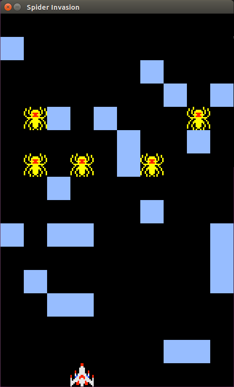

# SpiderInvasion

## Overview

Spider invasion is a video game developed with Pharo, Cairo on SDL. 

## Running the game

To run the game on Linux 64, clone the repository *demoLinux64* and run the script *start.sh*

## Development

To contribute to the game, you need to start the UI. Clone everything, got to *demoLinux64*, run *./pharo-ui Pharo.image* to start the IDE. To contribute, in the world menu (right click anywhere outside of IDE windows), choose *Monticello browser*, select the package *SpiderInvasion* and click save to load your code from Pharo to the files holding the code in the folder *src/SpiderInvasion*. You can then use standard git commands to commit your code in the *src* folder and to create a pull request.
